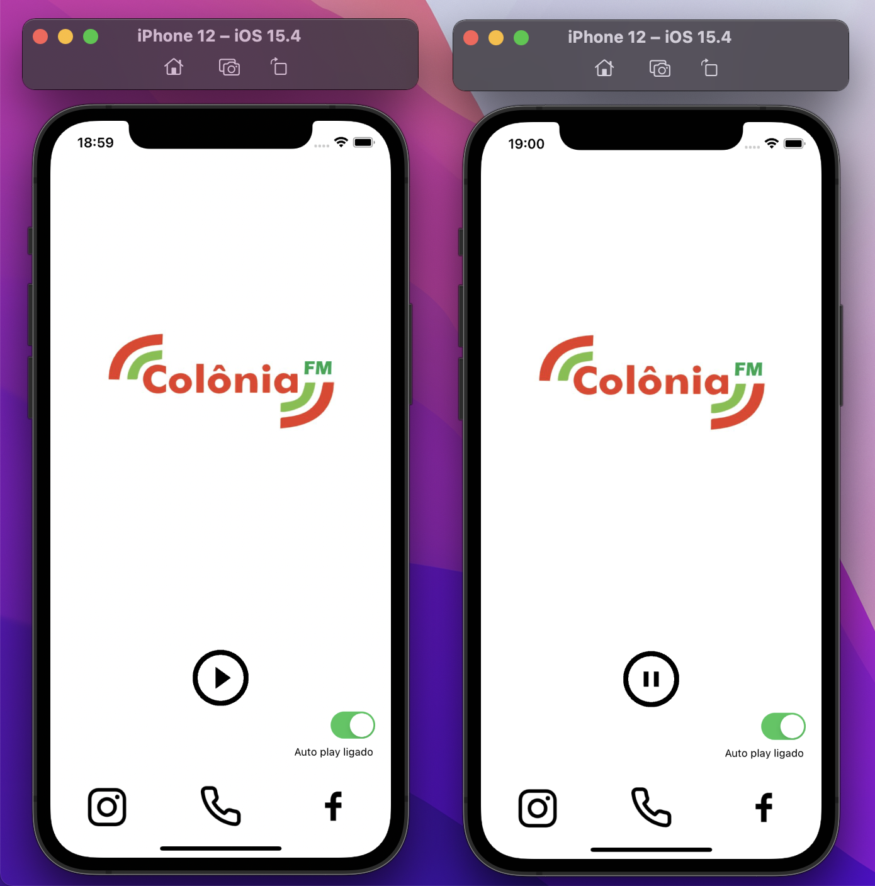

# OnlineRadioPlayer
A radio app to listen to music online, the user can access the radio's social network or make a call to ask a music, for example .

## The project
In this project I consume the streaming of an online radio, so there is a button with a function that play or pause the transmission.

I used *storyboard* to draw my screen. There is a *view stack* that contains all the functions to make a call to the radio center and open social networks to read the news that the radio has published.

Then I added an *option switch*, if it's on, the transmission  it will automatically play when the app launches.

When I clicked in *play button*, I checked that had a delay to transmission start, so to fix, I used an *activity indicator*. So the user can check that transmission is going to play soon.

**Learning about: Stack View, Activity Indicator, Option Switch, Streaming, Button, Label, Image, UIKit, MessageUI, AVFoundation, and more.**

*This project was developed as study.*
